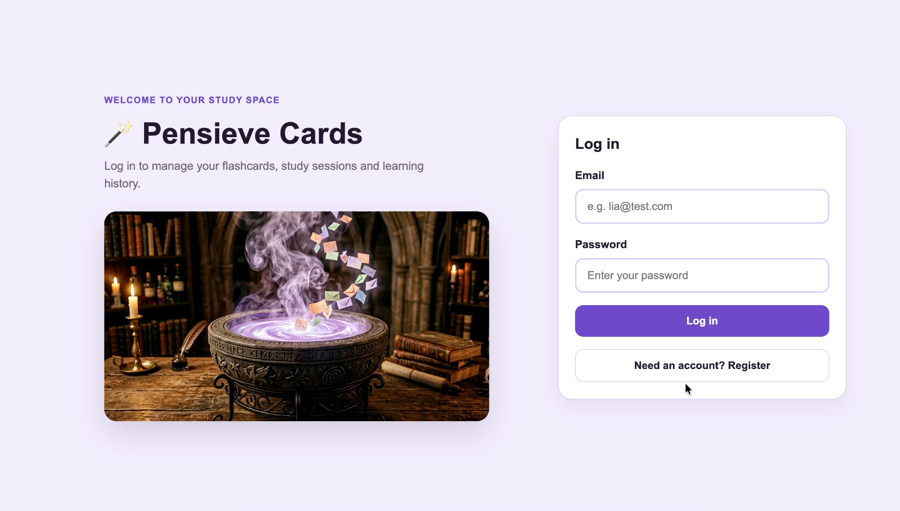

# Pensieve Cards

Pensieve Cards is a single-page flashcard learning app inspired by the wizarding world of Hogwarts, from Harry Potter. It allows users to create, search, edit, delete and study flashcards stored in a MongoDB database.

The app was extended for Assignment 2 of Internet Programming using React, authentication, role-based access control, multiple database entities and learning history tracking.

## Demo video

[](https://youtu.be/ajhH9VcxfIE)

[▶️ Watch demo video on YouTube](https://youtu.be/ajhH9VcxfIE)

## Problem this project solves

This website helps users organise and review study content in a quick and engaging way. Instead of relying on static notes, users can create short question-and-answer cards, group them by category, search them in real time and review them through a focused study session in the Study Room or directly in the Cards Library.

The app also supports individual user accounts, so each user can manage their own flashcards and learning history. Admin users can access an overview dashboard showing user activity across the app.

## Technical stack

- **Frontend:** React, Vite, JavaScript and CSS
- **Backend:** Node.js and Express
- **Database:** MongoDB Atlas with Mongoose
- **Architecture:** Single-page application with React state management
- **Styling:** Custom CSS with responsive layout and category-based visual themes
- **Routing:** Express API routes for authentication, flashcards, study history and admin overview
- **Authentication:** bcryptjs for password hashing and JWT for authenticated requests
- **Role-based access:** User and admin roles with protected backend middleware
- **Deployment:** Not deployed. The app runs locally.

## Features

- Single-page application behaviour using React
- User registration and login
- Password hashing with bcryptjs
- JWT-based authentication
- Role-based access control
- Admin dashboard with user and activity overview
- Flashcard CRUD operations:
  - Create flashcards
  - Read saved flashcards
  - Update existing flashcards
  - Delete flashcards
- User-specific flashcards
- Live search by keyword
- Dynamic category filters
- Study Room with shuffled study sessions
- Reveal answer interaction
- Session-based card removal after use
- Learning history table with:
  - Date and time
  - Category
  - Session status
  - Number of reviewed cards
  - Total duration
  - Average seconds per card
- Empty states and feedback toasts
- Responsive design
- Database export files in JSON format

## Database entities

The application uses three main database entities.

### User

Stores account and role information.

Main fields:

- `name`
- `email`
- `password`
- `role`, used to define whether the account is a regular user or an admin

### Flashcard

Stores flashcards created by users.

Main fields:

- `user`, automatically linked to the logged-in account
- `category`
- `question`
- `answer`

The `user` field is not manually filled in by the user. It is assigned by the backend so each flashcard belongs to the account that created it.

### StudyHistory

Stores records of completed or ended study sessions.

Main stored fields:

- `user`, automatically linked to the logged-in account
- `category`
- `totalCards`
- `completedCards`
- `status`
- `startedAt`
- `endedAt`

The interface calculates total duration and average seconds per card from `startedAt`, `endedAt` and `completedCards`.

## Authentication and role-based access

Users must register or log in before accessing the flashcard app. Passwords are hashed before being stored in MongoDB, and JWT tokens are used to authenticate API requests.

The application supports two user roles.

### Regular user

A regular user can:

- create their own flashcards
- view their own flashcards
- update their own flashcards
- delete their own flashcards
- start study sessions
- view their own learning history

### Admin user

An admin can:

- use the app as a normal user
- access the Admin Dashboard
- view aggregated data about all users, flashcards and study sessions

The admin route is protected in the backend using JWT authentication and an `adminOnly` middleware.

## Study session logic

The original study session logic from Assignment 1 was preserved in the React version of the app. In the Study Room, flashcards are loaded into a shuffled study session snapshot.

When the user reveals the answer and clicks **Next**, the current card is removed from the active study session only.

This means:

- the card disappears from the current study session after use
- the card is **not deleted** from the database
- the card remains available in the Cards Library for future sessions

This behaviour was chosen to preserve user data while still creating the feeling of moving through a physical flashcard deck, where cards are set aside after use instead of being discarded.

When a session is completed or ended after at least one reviewed card, a record is saved to the user's learning history.

## Folder structure

```text
flashcard-app/
├── client/
│   ├── public/
│   │   └── images/
│   │       └── pensieve.png
│   ├── src/
│   │   ├── components/
│   │   │   └── AuthForm.jsx
│   │   ├── services/
│   │   │   └── api.js
│   │   ├── App.jsx
│   │   ├── main.jsx
│   │   └── style.css
│   ├── index.html
│   ├── package.json
│   └── vite.config.js
│
├── database/
│   ├── flashcards.json
│   ├── studyhistories.json
│   └── users.json
│
├── images/
│   └── demo-thumbnail.png
│
├── server/
│   ├── middleware/
│   │   └── authMiddleware.js
│   ├── models/
│   │   ├── Flashcard.js
│   │   ├── StudyHistory.js
│   │   └── User.js
│   ├── routes/
│   │   └── authRoutes.js
│   ├── exportDatabase.js
│   └── server.js
│
├── .env.example
├── .gitignore
├── package.json
├── package-lock.json
└── README.md
```

## How to run the project

### 1. Clone the repository

```bash
git clone https://github.com/lia-dullius/flashcard-app.git
cd flashcard-app
```

### 2. Install backend dependencies

From the project root folder:

```bash
npm install
```

### 3. Install frontend dependencies

```bash
cd client
npm install
```

### 4. Create a `.env` file

Create a `.env` file in the project root and add your own MongoDB connection string, JWT secret and optional port:

```env
MONGODB_URI=your_mongodb_connection_string
JWT_SECRET=your_jwt_secret_key
PORT=3000
```

The `.env` file is ignored by Git and should not be uploaded to GitHub.

### 5. Start the backend server

From the project root folder:

```bash
npm start
```

The backend runs at:

```text
http://localhost:3000
```

### 6. Start the React frontend

In a second terminal:

```bash
cd client
npm run dev
```

The frontend runs at:

```text
http://localhost:5173
```

The backend must be running before using the frontend.

## API endpoints

### Authentication

- `POST /api/auth/register` — create a new user account
- `POST /api/auth/login` — log in and receive a JWT token

### Flashcards

- `GET /api/flashcards` — fetch flashcards owned by the logged-in user
- `POST /api/flashcards` — create a new flashcard
- `PUT /api/flashcards/:id` — update a flashcard owned by the logged-in user
- `DELETE /api/flashcards/:id` — delete a flashcard owned by the logged-in user

### Study history

- `GET /api/study-history` — fetch the logged-in user's study history
- `POST /api/study-history` — create a new study history record

### Admin

- `GET /api/admin/overview` — fetch admin overview data. This route requires a valid JWT and admin role.

### Health check

- `GET /api/health` — check whether the API is running

## Database export

Database export files are included in the `database/` folder:

```text
database/
├── flashcards.json
├── studyhistories.json
└── users.json
```

The `users.json` export masks hashed passwords for security. The real `.env` file and database credentials are not included in the repository.

## Demo accounts used during development

The database export includes sample users used to test role-based access and user-specific data isolation. Passwords are masked in the export for security.

To test the app locally, users can create a new account through the Register form. To test admin access, a user's `role` field can be changed from `user` to `admin` in MongoDB Atlas.

Demo credentials will also be provided privately through the assignment submission for marking. They are not included in this public repository to avoid exposing credentials.

## Workload allocation

This assignment was completed individually by Lia Pereira Dullius. All planning, interface design, frontend implementation, backend implementation, database modelling, authentication, role-based access, database export and documentation were completed by the author.

## Challenges overcome

One of the main challenges in Assignment 2 was extending the original flashcard app from a simpler JavaScript-based project into a React application with authentication, user-specific data and protected backend routes. This required restructuring the frontend logic around React state and API calls while preserving the original study flow.

A further challenge was implementing learning history as a third database entity while keeping the interface simple and meaningful. The final solution records completed or ended study sessions and presents them in a table with date, category, status, number of reviewed cards, total duration and average seconds per card. This gives users lightweight feedback on their study pace, allowing them to compare how quickly they move through cards across different sessions without adding unnecessary complexity to the app.

The project also required implementing role-based access control. Admin users can access aggregated app data, while regular users remain limited to their own flashcards and learning history. This helped demonstrate both frontend conditional rendering and backend route protection.

## Security notes

- Passwords are hashed before being stored in MongoDB.
- JWT tokens are used for authenticated API requests.
- Flashcard and study history routes are protected.
- Regular users can only access their own flashcards and study history.
- Admin routes are protected by role-based middleware.
- Sensitive environment variables are stored in `.env`.
- `.env` is ignored by Git.
- `.env.example` is included only as a safe template.
- Demo credentials are not included in the public repository.

## Author

Lia Pereira Dullius